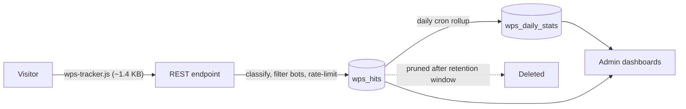

<div align="center">


# WP Statics

**Lightweight, privacy-friendly site analytics for WordPress and WooCommerce.**

<sub>آمار بازدید صفحات، کاربران آنلاین و تفکیک منبع بازدید به همراه گزارش فروش هر محصول ووکامرس</sub>

<br>


[Features](#-features) · [How it works](#-how-it-works) · [Installation](#-installation) · [Admin pages](#-admin-pages) · [Development](#-development)

</div>

---

WP Statics shows you who is visiting your site, which pages they read, where they came from (Google, Instagram, Telegram, Torob, Digikala, WhatsApp and more), and which traffic source actually leads to sales.

It runs inside your own WordPress database, so there is **no third-party script** and **no data leaves your server**.

## ✨ Features

| | Feature | Description |
|---|---|---|
| 📊 | **Overview dashboard** | Views, unique visitors and trends for the selected date range. |
| 🟢 | **Online users** | Who is on the site right now. |
| 🧭 | **Traffic sources** | Direct, Google, Bing, other search engines, Instagram, Telegram, WhatsApp, Torob, Digikala, Basalam, Bale, Rubika, Eitaa and other referrals, classified from UTM parameters and referrer hosts. |
| 📄 | **Top pages** | Most-viewed pages and posts, with a per-page channel breakdown. |
| 🛍️ | **WooCommerce products** | Sales and revenue per product, split by traffic source. |
| 🔻 | **Sales funnel** | How visitors move from views to cart to order. |
| 🚧 | **404 monitor** | The most-requested missing URLs, so you can fix broken links or add redirects. |
| 🔗 | **Link builder** | Generate UTM-tagged links for campaigns and social posts. |
| 🏷️ | **Order channel attribution** | Each WooCommerce order is tagged with the channel that brought the customer; admins can override it from the order screen. |
| 📥 | **CSV export** | Export any report. |
| 🤖 | **Bot filtering** | Known crawlers and headless clients are excluded from the numbers. |

## ⚙️ How it works



1. **Beacon.** A tiny front-end script (`assets/js/wps-tracker.js`, about 1.4 KB) sends the page URL, referrer and UTM parameters to a REST endpoint after the page loads. It does not block rendering and loads no external library.
2. **Classification.** The endpoint classifies the visit on the server (`WPS_Source_Classifier`), filters bots, rate-limits per visitor hash and writes a row to a custom hits table.
3. **Rollup.** A daily cron job rolls raw hits into a summary table (`wp_wps_daily_stats`) and prunes raw rows after the retention window. Summaries are kept indefinitely, so long-term reports stay fast.
4. **Reporting.** The admin pages read from the summary and raw tables and render charts with the bundled Chart.js.

### 🔒 Privacy

WP Statics is **cookieless**.

- Each visitor gets a token derived with a keyed HMAC from IP, user agent, the current day and a site-specific salt. The token rotates daily, so visits cannot be linked across days.
- IP addresses are stored only as a separate salted hash, used for rate limiting.
- Raw hits are deleted after the retention period (**35 days** by default, configurable in settings). Daily summaries are kept.

## 📋 Requirements

| Component | Version |
|---|---|
| WordPress | 6.9 or higher |
| PHP | 7.4 or higher |
| WooCommerce | Optional. Required only for product sales and order attribution. |

## 🚀 Installation

1. Copy the `wp-statics` folder into `wp-content/plugins/`, or upload the zip from **Plugins → Add New → Upload Plugin**.
2. Activate **WP Statics** from the **Plugins** screen. The activator creates its tables.
3. Open **آمار سایت** (Site Stats) in the admin menu.
4. *Optional:* adjust the retention window and other options on the settings page.

## 🗂️ Admin pages

| Page | Slug | What it shows |
|---|---|---|
| نمای کلی (Overview) | `wp-statics` | Totals and trends |
| کاربران آنلاین (Online) | `wp-statics-online` | Live visitors |
| منابع بازدید (Sources) | `wp-statics-sources` | Traffic by channel |
| صفحات پربازدید (Pages) | `wp-statics-pages` | Top content |
| محصولات (Products) | `wp-statics-products` | WooCommerce sales by product and source |
| قیف فروش (Funnel) | `wp-statics-funnel` | Conversion steps |
| صفحات یافت نشد (404s) | `wp-statics-404s` | Broken URLs |
| تنظیمات (Settings) | `wp-statics-settings` | Retention and options |

## 🛠️ Development

```text
wp-statics/
├── wp-statics.php            # bootstrap, constants, hooks
├── includes/                 # core: tracking endpoint, repositories, cron, classifiers
├── admin/                    # admin menu and page renderers
├── assets/
│   ├── js/                   # wps-tracker.js (front end), admin scripts
│   ├── css/
│   └── vendor/chartjs/       # bundled Chart.js (admin only)
└── uninstall.php             # removes plugin tables and options
```

Core classes use the `WPS_` prefix. Channel slugs and their labels live in one place, `WPS_Source_Classifier`, so the tracker, the dashboards and WooCommerce attribution always report against the same taxonomy.

<details>
<summary><b>Adding a traffic source</b></summary>

<br>

In `WPS_Source_Classifier`:

1. Add its `utm_source` aliases to `UTM_ALIASES`.
2. Add its domains to `DOMAIN_MAP`.
3. Add a label to `LABELS`.

</details>

## 🗑️ Uninstalling

Deleting the plugin from the **Plugins** screen runs `uninstall.php`, which drops the plugin's tables (`wps_hits`, `wps_daily_stats`, `wps_sales_daily`, `wps_presence`), deletes its options and clears its scheduled jobs.

## 📝 Changelog

| Version | Notes |
|---|---|
| **0.2.1** | Current version. |

## 📄 License

Add your license here.
